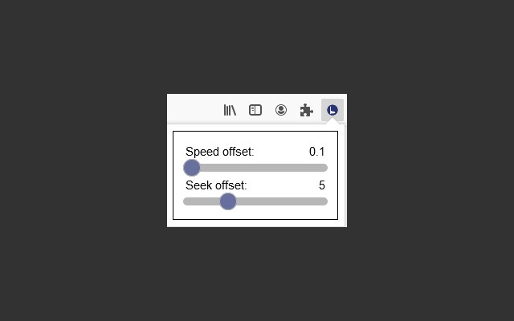
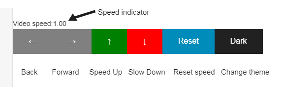
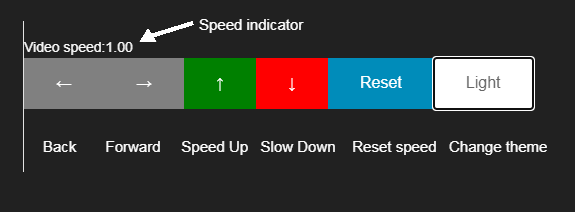

# BBB Buttons extensions

BBB Buttons is a single file script for adding media-playback controls to BigBlueButton recordings.
From students, for students. This is a continuation of the project. It converts the simple script
into a browser extension so students can spend more time copy-pasting stack overflow code instead 
of the script. 

It adds automatic loading of the script when a BBB recording is opened and some options to customize the
experience to your liking. 

Future features might be coming. Who knows when, who knows if. 

Feel free to PR if I see it, I will definitely consider it.
Honorable mention: [@becutandavid](https://github.com/becutandavid) who made the original Pull Request for a Firefox add-on. Checkout his version [here](https://github.com/becutandavid/bbb_buttons/tree/firefox_addon).

# Usage

You can find the extension for Chrome [here](https://chrome.google.com/webstore/detail/bigbluebutton-buttons/dhchhdbeibepkacjikkolhimlemkkjam?hl=en-GB&authuser=1).
The add-on for Firefox can be snatched from [here](https://addons.mozilla.org/en-US/firefox/addon/bigbluebutton-buttons/).
Add it to your browser of choice and use it right away.
**Make sure the extension is pinned to your browser toolbar for the full experience.**

For users of other browser I am sorry, but I am a one man team. However the original [BBB buttons](https://github.com/Kotesitory/bbb_buttons) project is here and most browsers support modern JS so check it out.

The code for the extensions is written to be cross-compatible with Mozilla Firefox and Google Chrome. Due to
incompatibilities in the browser APIs a few thing should be changed when trying to import the extension manually.

If you want to import it to Chrome make sure to find all comments in `bbb_script.js` and `popup/popup.js` that mention **replace [chrome] with [browser]**. The API is the same however they call the instance of their own browser differently.
For Firefox do the same just replace [chrome] with [browser]. (do not use the "[", "]", ex: `browser.storage.. ----> chrome.storage..`).

In the `manifest.json` file change:

```
...
permissions": ["storage"],
// Comment out [browser_specific_settings] for chrome and uncomment for Firefox
"browser_specific_settings": {			<---- For Mozilla keep, for Chrome comment out the whole [browser_specific_settings] node
	"gecko": {
		"id": "skotevski10@gmail.com"
	}
 },
 "icons": { 
...
```

### Adjusting

Adjustments can be made in the extension popup, by clicking on the extension icon on the browser toolbar.



### Light Theme

Now available in light and dark mode (thanks to [@stefan-krstikj](https://github.com/stefan-krstikj)) to protect those precious student eyes.



### Dark Theme

